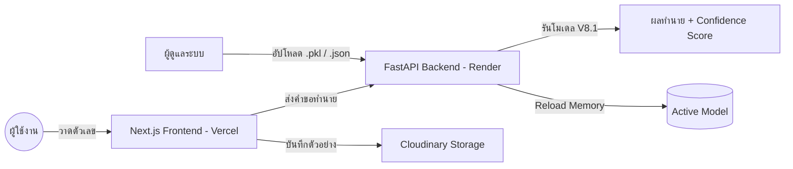

# ระบบทำนายลายมือตัวเลขไทย (๓๖ - ๔๐) ด้วย Machine Learning (V8.1)

โปรเจค Full-stack Machine Learning สำหรับจำแนกและเก็บรวบรวมลายมือตัวเลขไทย (๓๖-๔๐) พัฒนาด้วยสถาปัตยกรรม Hybrid-cloud โดยใช้ Next.js, FastAPI และโมเดล ExtraTrees (V8.1)

[](https://mini-pj-online.vercel.app/)
[](https://mini-projectcs462.onrender.com/docs)
[](https://vercel.com/)

---

## คุณสมบัติหลัก (Key Features)

- **ระบบทำนายผล V8.1:** ทำนายลายมือตัวเลขไทยแบบ Real-time ด้วยโมเดล ExtraTrees ที่มีความแม่นยำสูง (Accuracy: 96.36%)
- **ระบบเก็บข้อมูล Dataset (Cloudinary):** บันทึกตัวอย่างลายมือใหม่ลงสู่ Cloudinary โดยตรง เพื่อแก้ปัญหาการเก็บไฟล์บน Vercel และสะสมข้อมูลสำหรับการเทรนในอนาคต
- **การอัปเดตโมเดล (Admin Dashboard):** หน้าจอส่วนผู้ดูแลระบบสำหรับการอัปโหลดไฟล์โมเดล (.pkl) และ Metrics (.json) เพื่อเปลี่ยนการทำงานของระบบได้ทันทีโดยไม่ต้อง Deploy ใหม่
- **การรองรับอุปกรณ์:** รองรับทั้ง Mouse และ Touch สำหรับการวาดบน Canvas
- **สถาปัตยกรรมระบบ:** แยกส่วน Frontend (Vercel) และ Backend (Render) เพื่อประสิทธิภาพและความเสถียร

---

## เทคโนโลยีที่ใช้ (Tech Stack)

| ส่วนงาน | เทคโนโลยี |
| :--- | :--- |
| **Frontend** | Next.js 15 (React, TypeScript, Tailwind CSS) |
| **AI Backend** | FastAPI (Python 3.12+) |
| **Machine Learning** | Scikit-learn (ExtraTreesClassifier), NumPy, PIL |
| **Cloud Storage** | Cloudinary (Persistent Image Storage) |
| **Deployment** | Vercel (Frontend) & Render.com (Backend) |

---

## แผนผังการทำงาน (System Architecture)



---

## รายละเอียดทางเทคนิค (Machine Learning V8.1)

1. **Preprocessing (V8.1 Optimization):** 
   - **Grayscale Conversion:** แปลงภาพเป็นระบบสีเทา
   - **Centering & Bounding Box:** จัดกึ่งกลางตัวเลข
   - **Padding 8px:** ปรับลด Padding เพื่อให้ตัวเลขมีขนาดใหญ่ขึ้น (ชัดเจนขึ้นสำหรับ AI)
   - **Thresholding:** ทำ Binary Thresholding (ปิด Dilation เพื่อรักษาหัวเลข ๓๖)
2. **Model:** ExtraTreesClassifier (Accuracy: 96.36%)
3. **Dataset:** เพิ่มข้อมูลเลข **๓๖** เป็น 285 รูป เพื่อแก้ปัญหา Data Imbalance

---

## การติดตั้งเพื่อใช้งาน (Local Development)

### 1. ความต้องการของระบบ
- Node.js 18+
- Python 3.9+
- Cloudinary Account

### 2. การตั้งค่า Backend (Python)
```powershell
cd backend
python -m venv .venv
.\.venv\Scripts\Activate.ps1
pip install -r requirements.txt
python main.py
```

### 3. การตั้งค่า Frontend (Next.js)
```powershell
npm install
npm run dev
```
สร้างไฟล์ `.env.local`:
```text
NEXT_PUBLIC_BACKEND_URL=http://localhost:8000
CLOUDINARY_CLOUD_NAME=your_cloud_name
CLOUDINARY_API_KEY=your_api_key
CLOUDINARY_API_SECRET=your_api_secret
```

---

## เอกสารอ้างอิง

- [คู่มือการติดตั้งออนไลน์ (Vercel + Render)](./DEPLOYMENT_GUIDE_TH.txt)
- [วิธีใช้งานระบบเบื้องต้น](./HOW_TO_USE_TH.txt)

---
**โปรเจควิชา CS462 Data Analytics and Mining**
*Last Updated: 2026-05-11 | Status: V8.1 Online*
