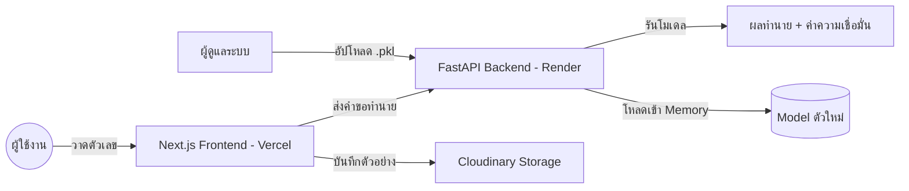

# ✍️ ระบบทำนายลายมือตัวเลขไทย (๓๖ - ๔๐) ด้วย Machine Learning

โปรเจค Full-stack Machine Learning สำหรับจำแนกและเก็บรวบรวมลายมือตัวเลขไทย (๓๖-๔๐) พัฒนาด้วยสถาปัตยกรรม Hybrid-cloud ที่ทันสมัยโดยใช้ Next.js, FastAPI และโมเดล Random Forest

[](https://mini-pj-online.vercel.app/)
[](https://mini-projectcs462.onrender.com/docs)
[](https://vercel.com/)

---

## 🌟 คุณสมบัติเด่น (Key Features)

- **🎯 ระบบทำนายผลอัจฉริยะ:** ทำนายลายมือตัวเลขไทยแบบ Real-time ด้วยโมเดล Random Forest ที่มีความแม่นยำสูง
- **📁 ระบบเก็บข้อมูล Dataset:** มี Canvas สำหรับวาดและบันทึกตัวอย่างลายมือใหม่ลงสู่ **Cloudinary** โดยตรง เพื่อสะสมข้อมูลสำหรับการเทรนในอนาคต
- **🧠 อัปเดตโมเดลแบบ Real-time:** หน้าจอ Admin สำหรับอัปโหลดไฟล์โมเดล (`.pkl`) และเปลี่ยน "สมอง" ของ AI ได้ทันทีโดยไม่ต้องรีสตาร์ทเซิร์ฟเวอร์
- **📱 รองรับทุกอุปกรณ์:** ออกแบบมาให้ใช้งานได้ดีทั้งบนคอมพิวเตอร์ แท็บเล็ต และมือถือ (รองรับระบบสัมผัส)
- **⚡ สถาปัตยกรรม Hybrid:** แยกส่วน Frontend (Vercel) และ Backend (Render) เพื่อประสิทธิภาพและความเสถียรสูงสุด

---

## 🏗️ เทคโนโลยีที่ใช้ (Tech Stack)

| ส่วนงาน | เทคโนโลยี |
| :--- | :--- |
| **Frontend** | [Next.js 15](https://nextjs.org/) (React, TypeScript, Tailwind CSS) |
| **AI Backend** | [FastAPI](https://fastapi.tiangolo.com/) (Python 3.12+) |
| **Machine Learning** | Scikit-learn, NumPy, PIL (Pillow) |
| **Cloud Storage** | [Cloudinary](https://cloudinary.com/) (เก็บรูปภาพ Dataset ถาวร) |
| **Deployment** | Vercel (Frontend) & Render.com (Backend) |

---

## 🚀 แผนผังการทำงาน (System Architecture)



---

## 🛠️ การติดตั้งเพื่อพัฒนาต่อ (Local Development)

### 1. สิ่งที่ต้องเตรียม
- Node.js 18 ขึ้นไป
- Python 3.9 ขึ้นไป
- บัญชี Cloudinary (สำหรับระบบเก็บข้อมูล)

### 2. ตั้งค่า Backend (Python)
```powershell
cd backend
python -m venv .venv
.\.venv\Scripts\Activate.ps1
pip install -r requirements.txt
python main.py
```

### 3. ตั้งค่า Frontend (Next.js)
```powershell
npm install
npm run dev
```
สร้างไฟล์ `.env.local` และกำหนดค่าดังนี้:
```text
NEXT_PUBLIC_BACKEND_URL=http://localhost:8000
CLOUDINARY_CLOUD_NAME=ชื่อ_cloud_ของคุณ
CLOUDINARY_API_KEY=api_key_ของคุณ
CLOUDINARY_API_SECRET=api_secret_ของคุณ
```

---

## 📂 โครงสร้างโปรเจค

- `backend/`: ส่วนการทำงานของ FastAPI และ Logic ของ AI
- `src/app/`: โครงสร้างหน้าเว็บ Next.js (App Router) และ API Proxy
- `src/components/`: คอมโพเนนต์ React (Canvas สำหรับวาดรูป)
- `models/`: ที่เก็บไฟล์โมเดล (.pkl) และค่าสถิติต่างๆ
- `dataset/`: โฟลเดอร์เก็บรูปภาพตัวอย่างสำหรับใช้เทรน (Local)

---

## 🧪 รายละเอียด Machine Learning

1. **Preprocessing (การเตรียมภาพ):** 
   - แปลงเป็นภาพขาวดำ (Grayscale)
   - การหาขอบเขตและจัดกึ่งกลางตัวเลข (Centering & Bounding Box)
   - ปรับขนาดเป็น 28x28 พิกเซล
   - Binary Thresholding เพื่อทำให้เส้นวาดชัดเจนที่สุด
2. **Model:** ใช้ Random Forest Classifier (100 estimators)
3. **Accuracy:** ประมาณ 90% (ขึ้นอยู่กับจำนวน Dataset ปัจจุบัน)

---

## 📄 เอกสารเพิ่มเติม

- [คู่มือการติดตั้งออนไลน์ (ฉบับเต็ม)](./DEPLOYMENT_GUIDE_TH.txt)
- [หน่วยความจำโปรเจค (สำหรับ AI)](./GEMINI.md)

---
**โปรเจควิชา CS462 Machine Learning Assignment**  
*พัฒนาโดยการสนับสนุนจาก AI Assistant (Gemini CLI)*
