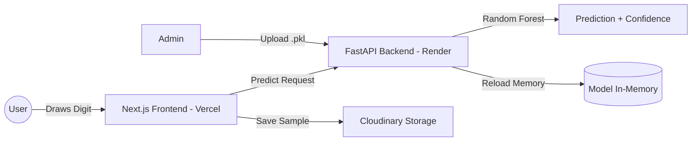

# ✍️ Thai Handwriting Recognition ML System (๓๖ - ๔๐)

A professional, full-stack Machine Learning application for recognizing and collecting Thai handwritten digits (36-40). Built with a modern hybrid-cloud architecture featuring Next.js, FastAPI, and Random Forest.

[](https://mini-pj-online.vercel.app/)
[](https://mini-projectcs462.onrender.com/docs)
[](https://vercel.com/)

---

## 🌟 Key Features

- **🎯 Intelligent Prediction:** Real-time Thai digit recognition using a Random Forest classifier.
- **📁 Dataset Collection:** Integrated canvas for drawing and saving new samples directly to **Cloudinary** for persistent storage.
- **🧠 Dynamic Model Loading:** Admin interface to upload and swap ML models (`.pkl`) in real-time without server restarts.
- **📱 Responsive Design:** Fully optimized for desktop and mobile tablets with touch support.
- **⚡ Hybrid Architecture:** Decoupled Frontend (Vercel) and Backend (Render) for optimal performance and scalability.

---

## 🏗️ Technology Stack

| Layer | Technology |
| :--- | :--- |
| **Frontend** | [Next.js 15](https://nextjs.org/) (React, TypeScript, Tailwind CSS) |
| **AI Backend** | [FastAPI](https://fastapi.tiangolo.com/) (Python 3.12+) |
| **Machine Learning** | Scikit-learn, NumPy, PIL |
| **Image Storage** | [Cloudinary](https://cloudinary.com/) (Persistent Cloud Storage) |
| **Deployment** | Vercel (Frontend) & Render.com (Backend) |

---

## 🚀 System Architecture



---

## 🛠️ Local Development

### 1. Prerequisites
- Node.js 18+
- Python 3.9+
- Cloudinary Account (for data collection)

### 2. Backend Setup
```powershell
cd backend
python -m venv .venv
.\.venv\Scripts\Activate.ps1
pip install -r requirements.txt
python main.py
```

### 3. Frontend Setup
```powershell
npm install
npm run dev
```
Configure `.env.local`:
```text
NEXT_PUBLIC_BACKEND_URL=http://localhost:8000
CLOUDINARY_CLOUD_NAME=your_name
CLOUDINARY_API_KEY=your_key
CLOUDINARY_API_SECRET=your_secret
```

---

## 📂 Project Structure

- `backend/`: FastAPI implementation & AI Logic.
- `src/app/`: Next.js App Router (Pages & API Proxy).
- `src/components/`: Reusable React components (Drawing Canvas).
- `models/`: Pre-trained models (`.pkl`) and metrics.
- `dataset/`: (Local) Image samples for training.

---

## 🧪 Machine Learning Details

1. **Preprocessing:** 
   - Grayscale conversion
   - Centering & Bounding Box cropping
   - Resize to 28x28 pixels
   - Binary Thresholding (Standardizing stroke clarity)
2. **Model:** Random Forest Classifier (100 estimators).
3. **Accuracy:** ~90% (based on current dataset).

---

## 📄 Documentation

- [Deployment Guide (Thai)](./DEPLOYMENT_GUIDE_TH.txt) - Step-by-step cloud setup.
- [Project Memory (AI Info)](./GEMINI.md) - Internal technical details.

---
**CS462 Machine Learning Assignment**  
*Developed with ❤️ and AI Assistance*
