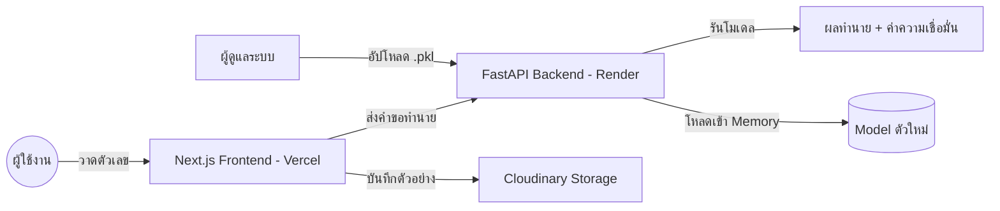

# ระบบทำนายลายมือตัวเลขไทย (๓๖ - ๔๐) ด้วย Machine Learning

โปรเจค Full-stack Machine Learning สำหรับจำแนกและเก็บรวบรวมลายมือตัวเลขไทย (๓๖-๔๐) พัฒนาด้วยสถาปัตยกรรม Hybrid-cloud โดยใช้ Next.js, FastAPI และโมเดล Random Forest

[](https://mini-pj-online.vercel.app/)
[](https://mini-projectcs462.onrender.com/docs)
[](https://vercel.com/)

---

## คุณสมบัติหลัก (Key Features)

- **ระบบทำนายผล:** ทำนายลายมือตัวเลขไทยแบบ Real-time ด้วยโมเดล Random Forest ที่มีความแม่นยำสูง
- **ระบบเก็บข้อมูล Dataset:** ส่วนประสานงานสำหรับวาดและบันทึกตัวอย่างลายมือใหม่ลงสู่ Cloudinary เพื่อสะสมข้อมูลสำหรับการเทรนในอนาคต
- **การอัปเดตโมเดล:** หน้าจอส่วนผู้ดูแลระบบสำหรับการอัปโหลดไฟล์โมเดล (.pkl) และเปลี่ยนการทำงานของระบบได้ทันทีโดยไม่ต้องรีสตาร์ทเซิร์ฟเวอร์
- **การรองรับอุปกรณ์:** ออกแบบมาให้ใช้งานได้สมบูรณ์ทั้งบนคอมพิวเตอร์ แท็บเล็ต และโทรศัพท์มือถือ
- **สถาปัตยกรรมระบบ:** แยกส่วนการทำงานระหว่าง Frontend (Vercel) และ Backend (Render) เพื่อความเสถียรของระบบ

---

## เทคโนโลยีที่ใช้ (Tech Stack)

| ส่วนงาน | เทคโนโลยี |
| :--- | :--- |
| **Frontend** | Next.js 15 (React, TypeScript, Tailwind CSS) |
| **AI Backend** | FastAPI (Python 3.12+) |
| **Machine Learning** | Scikit-learn, NumPy, PIL (Pillow) |
| **Cloud Storage** | Cloudinary (Persistent Cloud Storage) |
| **Deployment** | Vercel (Frontend) & Render.com (Backend) |

---

## แผนผังการทำงาน (System Architecture)



---

## การติดตั้งเพื่อใช้งาน (Local Development)

### 1. ความต้องการของระบบ
- Node.js 18 ขึ้นไป
- Python 3.9 ขึ้นไป
- บัญชี Cloudinary

### 2. การตั้งค่า Backend (Python)
```powershell
cd backend
python -m venv .venv
.\.venv\Scripts\Activate.ps1
pip install -r requirements.txt
python main.py
```

### 3. การตั้งค่า Frontend (Next.js)
```powershell
npm install
npm run dev
```
สร้างไฟล์ .env.local และกำหนดค่าดังนี้:
```text
NEXT_PUBLIC_BACKEND_URL=http://localhost:8000
CLOUDINARY_CLOUD_NAME=ชื่อ_cloud_ของคุณ
CLOUDINARY_API_KEY=api_key_ของคุณ
CLOUDINARY_API_SECRET=api_secret_ของคุณ
```

---

## โครงสร้างโปรเจค

- `backend/`: ส่วนการทำงานของ FastAPI และตรรกะของ AI
- `src/app/`: โครงสร้างหน้าเว็บ Next.js (App Router)
- `src/components/`: ส่วนประกอบของอินเตอร์เฟส (Drawing Canvas)
- `models/`: แหล่งเก็บไฟล์โมเดล (.pkl) และข้อมูลทางสถิติ
- `dataset/`: โฟลเดอร์เก็บข้อมูลภาพตัวอย่าง

---

## รายละเอียดทางเทคนิค (Machine Learning)

1. **Preprocessing (การเตรียมข้อมูล):** 
   - การแปลงภาพเป็นระบบสีเทา (Grayscale)
   - การจัดกึ่งกลางและตัดขอบเขตตัวเลข (Centering & Bounding Box)
   - การปรับขนาดภาพเป็น 28x28 พิกเซล
   - การทำ Binary Thresholding เพื่อเพิ่มความคมชัดของเส้น
2. **Model:** Random Forest Classifier (100 estimators)
3. **Accuracy:** ประมาณ 90% (ขึ้นอยู่กับชุดข้อมูลที่ใช้เทรน)

---

## เอกสารอ้างอิง

- [คู่มือการติดตั้งออนไลน์](./DEPLOYMENT_GUIDE_TH.txt)

---
**โปรเจควิชา CS462 Machine Learning Assignment**
